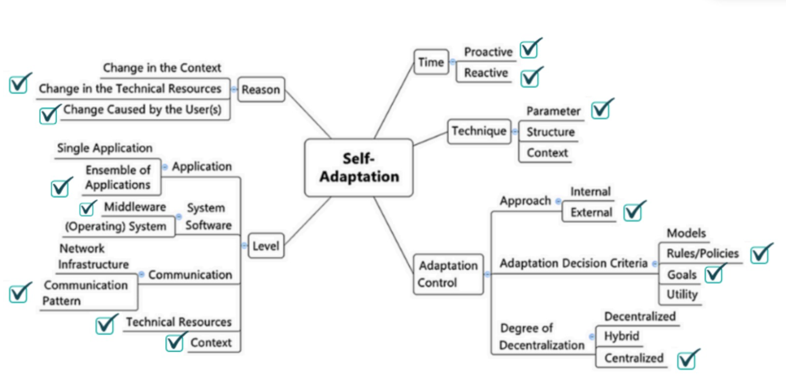
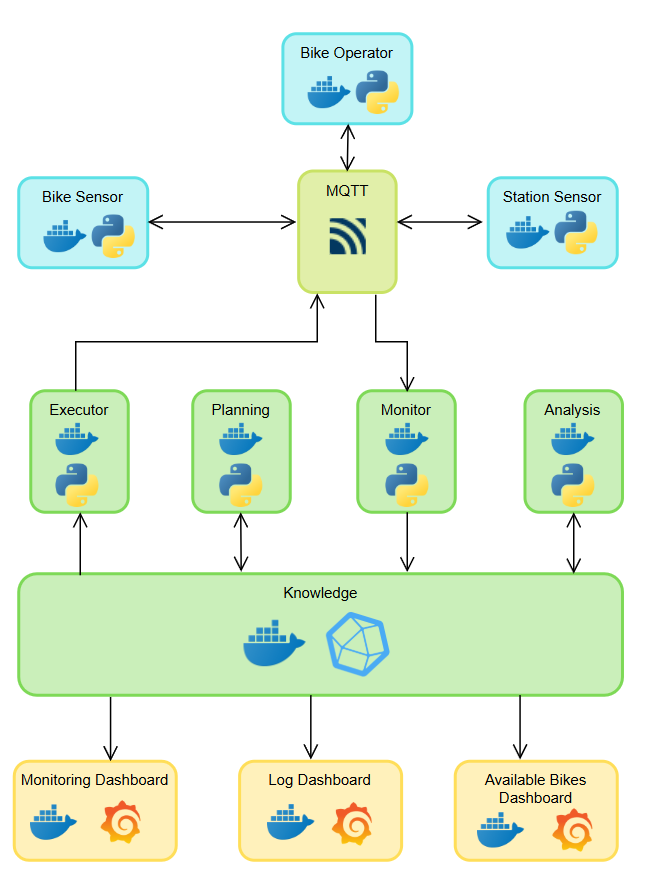
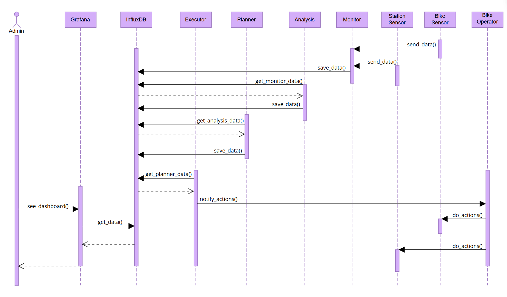
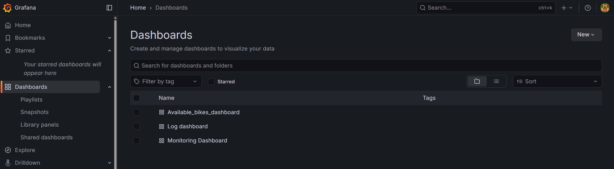
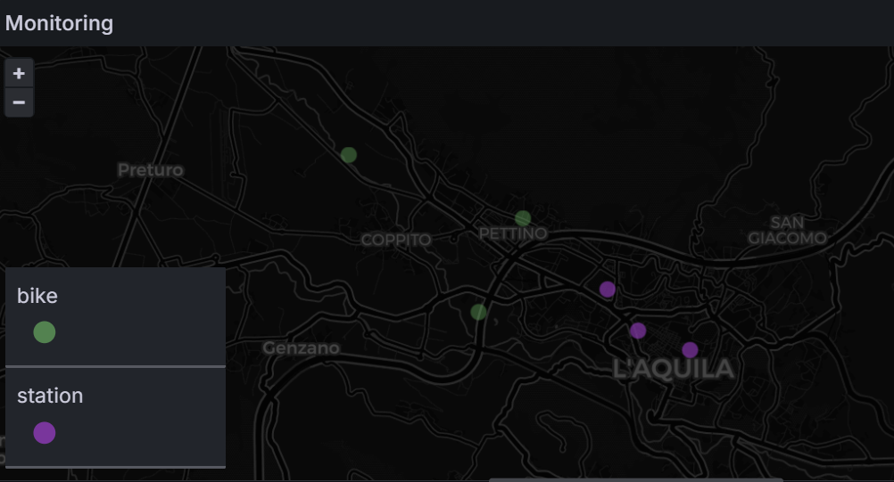
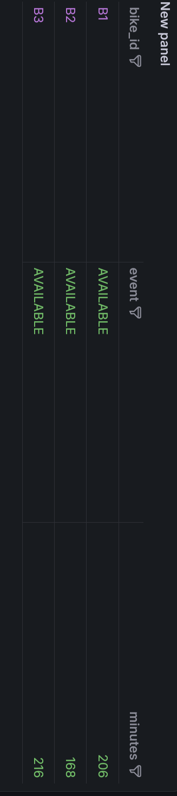
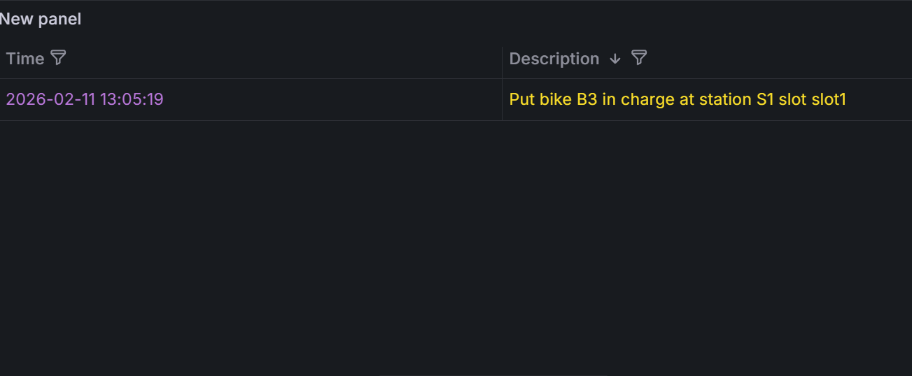

<script type="text/javascript" src="http://cdn.mathjax.org/mathjax/latest/MathJax.js?config=TeX-AMS-MML_HTMLorMML"></script>

# 🚲 **GreenMoving**

**Version:** 1.0  
**Last Update:** 02/11/2026

## 📖 **Project Description**
### **Introduction**
This project presents the design and implementation of a Self-Adaptive Management System for an urban E-Bike sharing service, orchestrated via Docker it integrates Python-based autonomous agents with InfluxDB for time-series data storage and Grafana for real-time observability. By leveraging a distributed architecture and a MAPE-K (Monitor-Analyze-Plan-Execute-Knowledge), the system autonomously manages e-bikes and smart charging stations.
### **Managed Resources**
**Electric Bikes (E-Bikes)**
The Bikes are the primary mobile assets, each unit is managed as an edge device providing real-time telemetry.
- *State variables*: StateOfCharge, geographic coordinates (lat,lon), lock status, and availability.
- *Management Logic**: System monitors these resources to ensur operational integrity and availability of bikes.
- *Booking bikes logic*: A simulation of user has been integrated, this component acts as a random external environment, triggering changes that the system must perceive and manage autonomously.

**Charging Stations**
The Stations represent the fixed infrastructure and act as "hubs" for the bikes, each stations has the same number of slots. 
- *State Variables*: slot occupancy, slot status, geografic fixed position and total charging power (W).
- *Monitoring Logic*: The system manages station capacity to maintain an equilibrium between supply and demand. Their management is strictly event-driven to ensure maximum energy efficiency and prevent waste, stations are triggered to send state updates only in these cases.
  - Connection
  - Disconnection
  - Bike Fully Charged

**Energy**
Energy is treated as a finite, shared resource constrained by the station's maximum power capacity ($P_{tot}$).
- *State Variable*: Power delivery per slot ($P_{i}$) and total station load.
- *Monitoring Logic*: Instead of a static flow, energy is managed as a dynamic priority queue, the system "slices" the available power to maximize the number of fully charged bikes. This process is event-driven and balance is done only on stations updates.


### **Goals of the System**
This system aims to optimize an e-bike sharing ecosystem through real-time bikes monitoring, intelligent power distribution, and event-based stations rebalancing.

**Bikes Availability**
The system ensures that bikes remains operational and within authorized boundaries. It monitors telemetric data to trigger operator alerts under specific failure or risk conditions:
- **Geofencing Violation**
A bike is flagged if its coordinates fall outside the predefined operational polygon:  
$$\text{if } (lat < LAT_{min} \lor lat > LAT_{max}) \lor (lon < LON_{min} \lor lon > LON_{max})$$

- **Theft Detection**
Triggered when significant displacement is detected while the motor is locked and the battery is not charging:  
$$\text{if } (\Delta lat > \epsilon \lor \Delta lon > \epsilon) \land \text{locked} \land \neg \text{charging}$$

- **Critical State of Charge**
Automated reporting for maintenance when the State of Charge ($SoC$) falls below the safety threshold:  
$$\text{if } SoC < SoC_{threshold} \land \neg \text{charging}$$

- **Availability**
The system autonomously determines the if a bike is categorized as "Available" and bookable for the user,  when it meets specific constrain defined by the following formal logic:
$$\text{Available} \iff (SoC > SoC_{threshold}) \land (\neg \text{is\_available}) \land (\neg \text{is\_booked})$$

**Stations Load Balancing**
To prevent "dead zones," the system maintains station occupancy within a functional buffer, ensuring that users can always find a bike to rent or an empty slot to return one. The occupancy $N_{occ}$ is constrained by the total capacity $C$:
$$1 \le N_{occ} \le (C - 1)$$
If a station state reaches Full ($N_{occ} = C$) or Empty ($N_{occ} = 0$), the planning module identifies the optimal "Source-Sink" pair and issues a Structural Balance task to the operator dashboard.

**Priority Charging & Energy Management**
To maximize the number of "User-Ready" bikes and minimize energy waste, the system implements a Priority Charging Strategy. Instead of uniform distribution, power $P_{tot}$ is allocated to favor the bike closest to a full charge, accelerating its availability.
The power assignment for the priority bike ($P_p$) and the remaining $n-1$ bikes ($P_{other}$) is defined as follows:$$\begin{cases} 
P_p = 0.6 \cdot P_{tot} \\
P_{other} = \frac{0.4 \cdot P_{tot}}{n-1}
\end{cases}$$Logic: Once a bike reaches $SoC = 100\%$, its $P$ is set to $0$, and the system dynamically reassigns the priority status to the next candidate in the queue.

### **Self-Adaptation**

The system implements self-adaptive logic to autonomously manage bikes dynamics and energy distribution. Below is the classification of our adaptive strategy:

**Time**  
The system operates on a dual temporal scale:
- *Proactive*: Continuous monitoring of bikes to prevent theft, geofencing violations and maximize availability.
- *Reactive*: Event-driven monitoring for stations, where adaptation is triggered by specific state changes

**Technique**  
 The system evaluates real-time *parameters* (SoC, coordinates, occupancy) and adjustable thresholds to trigger corrective actions.

**Approach**  
The approach is *external*, as the adaptation logic is decoupled from the managed resources. The intelligence resides in the Planning and Executor modules, which perceive the state of bikes and stations through the network.

**Adaptation Decision Criteria**  
The system combines two paradigms:
- *Objective-based*: Maintaining station occupancy within the safety interval $1 \le N_{occ} \le (C - 1)$.
- *Rule-based*: Applying specific algorithms (e.g., the 60/40 power split) to optimize energy allocation based on priority queues.

**Degree of Centralization**  
Hybrid because while individual modules (Planning, Analysis, Executor) possess functional autonomy and local logic, they are coordinated through a centralized State Repository (InfluxDB) and orchestrated via Docker Compose.

**Reason**  
Triggering factors:
- *Technical Resource Evolution*: Natural decreasing of battery levels (SoC) during operation.
- *Human Intervention*: Operational changes introduced by the operator and user that books bikes.

**Application**:  
The system is composed of an *ensemble of independent microservices* (containers) that interact asynchronously.

**System Software**   
The software is a *Middleware* and acts as an abstraction layer between the physical/simulated infrastructure (sensors/actuators) and the high-level decision-making logic.

**Communication**  
System relies on specific *communication patterns*:
- *MQTT*: For low-latency, asynchronous message brokering between edge resources and the monitor.
- *InfluxDB*: For time-series data persistence and historical state analysis.

**Context & Technical Resources**   
The system monitors both the *context* (station full or empty) and the *technical resources* (level of battery)

<div style="page-break-after: always;"></div>

### **System Architecture**


#### **Sensors & Actuators**
The system interacts with the environment through three main entities using the MQTT protocol.
- *Bike Sensor*: Act as sensors (telemetry) and actuators (locking/availability).
  - `ebike/bikes/+/telemetry`: publisher
  - `ebike/bikes/+/commands`: subscriber
- *Station Sensor*: Manage physical charging and energy flow.
  - `ebike/stations/+/slots`: publisher
  - `ebike/stations/+/request`: subscriber
- *Bike Operator*: A specialized agent that performs physical tasks (moving bikes, manual charging) to simulate system dynamics.
  - `ebike/operators/events` subscriber

#### **Monitor**
The Monitor module acts as a bridge between the MQTT broker and the Time-Series Database (InfluxDB). It subscribes to telemetry and slot topics, persisting raw data into two primary measurements:

`bikes`

| bike_id | battery | motor_locked | is_charging | is_available | lat | lon |
|--------|-------|------|------|------|------|------|
| B1 | 89 | True | False | True | 42.3455 | 13.3554 |

`station`

| station_id | slot1 | slot1_rate | slot2 | slot2_rate | slot3 | slot3_rate | slot4 | slot4_rate| slot5 | slot5_rate | 
|--------|-------|------|------|------|------|------|-------|------|------|------|
| S1 | B1 | 20 | empty | 0 | empty | 0 | empty | 0 | empty | 0 |

`bookings`

| bike_id | user_id | time_start | time_end | 
|--------|-------|------|------|
| B1 | U1 | 13/02/2026-18.30 | 13/02/2026-19.30 |

#### **Analysis**
The Analysis module queries the raw data and applies threshold-based logic to detect critical states, generating Events that require adaptation:

`structural_balance`:
Monitors station occupancy

| station_id | event_type |
|--------|-------|
| S1 | FULL |


`energy_waste`: Detects changes in station connectivity to trigger power re-balancing.

| station_id | event_type |
|--------|-------|
| S1 | UPDATED |

`bike_recharging`:  Identifies units with $SoC < Threshold$

| bike_id | event |
|--------|-------|
| B1 | LOW_BATTERY |

`bike_availability`: Calculates real-time availability and time-to-readiness for the user dashboard.

| bike_id | event | minutes |
|--------|-------|-------|
| B1 | AVAILABLE | 5

`event`: A centralized logging measurement for human-readable audit trails.

| description |
|--------|
| Theft alarm for Bike B1 |


`book_bike` Calculates if a bike has to be locked or unlocked.

| bike_id | event |
|--------|-------|
| B1 | START |
| B2 | END |


#### **Planning**
The Planning module retrieves active events and calculates the optimal corrective actions using the system's optimization rules:

`plan_structural_balance`: Selects the best "Source-Sink" pair to move a bike from a full station to an empty one and viceversa.

| bike_id | station_id_start | slot_start | station_id_end | slot_end | 
|--------|-------|------|------|------|
| B1 | S1 | slot5 | S2 | slot1 |

`plan_recharging`: Identifies the optimal available slot for a low-battery bike and creates a reservation.

| bike_id | station_id | slot |
|------|------|------|
| B1 | S1 | slot3 |

`plan_energy_waste` Implements the Priority Charging Logic (60/40 split), calculating the precise charging rate for each docked bike.

| station_id | slot | rate | bike_id |
|------|------|------|------|
| S1 | slot2 | 10 | B1 |

`plan_book_bike` Identifies if a bike to unlock is under charging  and if it's necessary update some station state.

| bike_id | station_start | slot_start | event | 
|--------|-------|--------|-------|
| B1 | S1 | slot1 | START |


#### **Executor**
The Executor translates the high-level plans into actionable commands, dividing them into two execution paths:
- *Direct Automated Control*: It sends BALANCE requests directly to the Station topic (ebike/stations/+/request) to adjust charging rates in real-time.
- *Autonomous Lock State actuation*: The system performs autonomous physical security management by synchronizing the bike's locking mechanism with the rental lifecycle.
- *Human-in-the-loop Simulation*: Since structural rebalancing and charging connections require physical movement, the Executor dispatches MOVE or CHARGE tasks to the Bike Operator via the operator topic. 

<div style="page-break-after: always;"></div>

### **Sequence Diagram**


## 🚀 **Installation**

### **Prerequisites**
- Windows 10/11 
- Docker Desktop 4.58.0
- Python 3.13.9 (for local development and testing only)


### 🏗 **Project Structure**
```
📂 nome_progetto
┣ 📂 src/        # source code
┣ 📂 docs/       # documentation
┣ 📂 tests/      # Test unitari
┣ 📄 README.md   # Documentazione principale
```

### **Installation Steps**
1. Clone the repo
```sh
git clone https://github.com/m4rylu/SE4AS_GreenMoving
cd SE4AS_GreenMoving/src
```

2. Build and launch the system
```sh
docker-compose up --build -d
```

3. Navigate to http://localhost:3000/ where you will have access to all dashboards


4. Select one of them for retrieving information about monitoring, availability and events.

| Monitoring Dashboard | Availability Dashboard | Log Dashboard |
| :---: | :---: | :---: |
|  |  |  |
